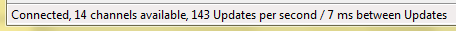
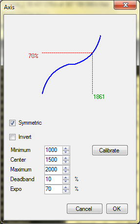
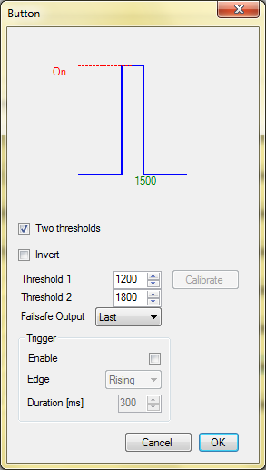
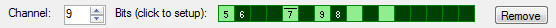
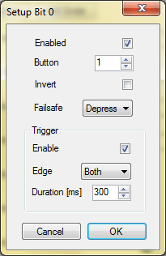

# VJoySerialFeeder Quickstart #
## Basic concepts ##

* Channel.\
   A channel is a stream of integer values coming through the serial port. There can be one or more channels multiplexed over the same serial line.
   > _Tech details:_ Serial data arrives in _frames_. Different protocols use different frame structures but in general a frame consists of a several numbers. The _stream_ consisting of the _first_ numbers from each frame can be thought of as _channel 1_. Every _second_ number in each frame represents _channel 2_ and so on.

* Mapping.\
A mapping is a _rule_ which transforms the integer channel data in a value that can be fed to the virtual joystick. There are three types of mappings:
  1. Axis Mapping - used to transform a channel to a joystick axis (X, Y, Slider, etc.).
  2. Button Mapping - used to transform channel value to a binary button state - pressed/depressed - using threshold(s).
  3. Bit-mapped Button Mapping - takes the channel value as 16-bit integer and allows each bit to command one button (16 buttons total).

Here is a simplified diagram of the data flow:

## How to use ##
1. You need a Virtual Joystick driver. The options are:
   * vJoy (Windows) - Emulates standard Windows joystick. [Download](https://sourceforge.net/projects/vjoystick/files/latest/download) and install the latest version of vJoy (2.x at this time). Refer to vJoy documentation if you have to.
   * vXbox (Windows) - Emulates a XBox 360 controller. [How-to](vXbox.md).
   * uinput (Linux) - uinput is standard part of linux. [How-to](Linux.md).

2. Then you have to decide how you are going to get the serial data you need. Some of the most common options are:
   * Use Arduino to read data from any device and send it to your PC. [How-to](Arduino.md).
   * Read controller directly from any IBUS capable FlySky receiver. [How-to](FlySky.md).
   * Read controller directly from any SBUS capable receiver (FrSky, Futaba, etc.). [How-to](Sbus.md).
   * Use MultiWii compatible Flight Controller (MultiWii, CleanFlight, BetaFlight, etc.). [How-to](MultiWii.md).

3. After your data provider is ready you should select the correct serial port. Click `Port Setup` and make sure the default port settings are correct for your case. If they are not click `Custom` and make the necessary adjustments.

4. Select the serial protocol (depends on your choice from step 2).

5. Select the correct Virtual Joystick.

6. Click the `Connect` button. If everything is OK you should see in the status bar something like:

7. Open the Channel Monitor (`Program`>`Channel Monitor`) and see if everything seems to be working OK. Try changing your inputs and confirm that channels are changing value.

8. Start mapping!\
   Use the `Add Axis`,  `Add Button` and `Add Bit-mapped Button` buttons to add mappings to the interface.\
   All mappings can take data from only one channel. Use the `Channel` input box to select it. What is done with the data depends on the mapping type.
   * In Axis Mappings, there is a `Axis` dropdown menu from which you can select the virtual joystick axis which you would like to command with the selected channel. Please note that your Virtual Joystick type and configuration may or may not have some of the axes enabled.
      Axis Mappings can be thought of as a function which take the input channel value and returns axis value between 0% and 100%.\
      In the `Setup` dialog there are various parameters which can be tweaked to make that function do what you need.

      

      * `Symmetric` tells if the axis has a center point. For example: symmetric axes are the X, Y of a joystick, while an asymmetric axis is the throttle. `Center` and `Deadband` parameters are available only in symmetric mode.
      * `Invert` simply inverts the function output - 0% becomes 100% and vice versa.
      The `Minimum` parameter determines the channel value which will transform to 0% axis position (100% in inverted). Channel values _less_ than `Minimum` are ignored and axis position will still be 0%.
      * The `Maximum` parameter is analogous.
      * The `Center` parameter determines the channel value which will translate to 50% axis position.
      * The `Deadband` defines a range around the center point which will always translate to 50% axis position.
      * `Expo` makes the channel value transformation a non linear function. The most common use is to make your controls less sensitive around the center and fully responsive near the endpoints.
	  * `Failsafe Output` determines what value will be outputted in case of Failsafe.
      * The `Calibrate` button allows easy setting of the `Minimum`, `Maximum` and `Center` parameters. Just click it and follow the instructions.

   * Button Mappings work by defining one or two thresholds. First you have to select the virtual `Button` (numbered from 1 to 128) that you would like to command with this channel. Please note that the actual number of buttons available depends on the Virtual Joystick type and configuration.
      Click `Setup` for more parameters:

      

      * In `one threshold` mode the button state is determined depending on the value being _lower_ or _higher_ than the threshold.
      * In `two thresholds` mode the button is in one state if the value is _between_ the two thresholds and in the other state if it is _outside_ them.
      * The `Invert` parameter inverts the button logic.
	  * `Failsafe Output` determines what the button state will be in case of Failsafe.
      * The `Calibrate` buttons allows for easy setup of the threshold. It only works in `one threshold` mode.

      The Trigger section allows your button to be activated only for a specific duration
      when the threshold(s) are crossed. Through the remaining time the button is depressed.
	  
      * `Enable` tells if the Button should work in trigger mode.
      * `Edge`. Consider a _uninverted_
	    non-trigger button: `Rising` edge would be the transition
	    from depressed to pressed state and `Falling` - from pressed to depressed.\
	    Trigger buttons are normally in depressed state. They become pressed only
	    when the above described edge conditions occur and they stay pressed for
	    `Duration` milliseconds, then become depressed again.\
	    `Both` tells that the button should be trigger on both `Rising` or `Falling`
	    edge.\
	    If a trigger button is `Invert`ed it will be normally in pressed state
	    and become depressed only for `Duration` milliseconds when triggered.

   * Bit-mapped Button Mappings take the channel's 16-bit value and allow each bit to be mapped to a button. The interface shows representation of the channel 16 bits as boxes:

      

      > _Tech details:_ The Least Significant Bit (LSB) is displayed on the _left_. The usual way to represent the bits of a number is to place the LSB to the _right_, but for our purposes LSB to the left makes more sense.

      Initially the bits are not mapped to anything. Click a bit box to set it up:

      

      * `Enable` tells that you want to map this bit.
      * `Button` selects the Virtual Joystick button you want to command with this bit.
        Normally, a zero bit results in depressed button and one bit - in pressed. If you want the reverse - check `Invert`.
	  * `Failsafe Output` determines what the button state will be in case of Failsafe.\
	  * For `Trigger` mode see the description for the Button Mapping.

      After a button has been mapped its virtual button id is shown in the box. If the button is inverted an overbar is shown above the number.

      > For unmapped bits (no number shown) the color of the box represents the _input_ bit. For mapped bits the color represents the virtual button state.

9. Save your your configuration as a `Profile`. Enter a profile name in the text box and click `Save`. The last used profile is automatically loaded on next run.

10. Enjoy!
