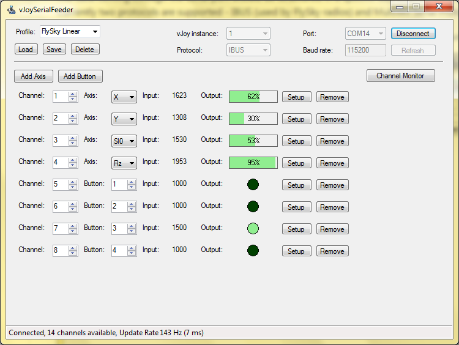

# VJoySerialFeeder #
## What is it? ##
A program for feeding data from a serial port to the [vJoy](http://vjoystick.sourceforge.net) virtual joystick driver (vJoy version 2.x is required).

The data coming through the serial port should be structured in a specific way in order for the feeder to recognize it. Currently two protocols are supported - IBUS (used by FlySky radio controllers) and MultiWii Serial Protocol (used by RC Flight Controllers running MultiWii, CleanFlight, BetaFlight, iNav, etc.).

After data is received it can be _mapped_ to any vJoy axis or button in very flexible and configurable way.

## Use cases ##
1. Use Arduino to read data from any device and send it to your PC - basic sketch in the [Arduino](Arduino/Joystick) directory. See [example](docs/Arduino.md) on using old RC controller for simulators.
2. Read controller directly from any IBUS capable FlySky receiver. [Example](docs/FlySky.md)
3. Use MultiWii compatible Flight Controller (MultiWii, CleanFlight, BetaFlight, etc.). Connect your RC model to your PC, choose the MultiWii protocol and open the USB serial port (the one you would normally use for your Configurator utility).
4. Feed over network. You can use pairs of virtual serial ports provided by [com0com](http://com0com.sourceforge.net/) and [com2tcp](https://sourceforge.net/projects/com0com/files/com2tcp) for the TCP/IP transport. Another option is [HW VSP3](https://www.hw-group.com/products/hw_vsp/index_en.html) which combines the virtual serial port and the TCP/IP transport but the free version allows only one COM port.

## How to get it? ##
You can dowload binaries from the [releases](../../releases) section or you can build it yourself. Development is done with [SharpDevelop 4.4](http://www.icsharpcode.net/opensource/sd/)

## How to use it? ##
Check out the [Manual](docs/MANUAL.md).
