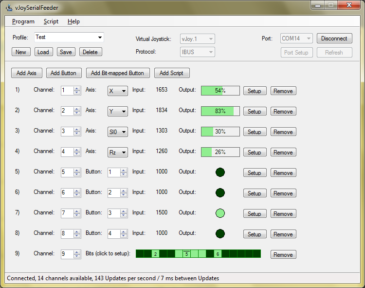

# VJoySerialFeeder #

## What is it? ##
A program for feeding data from a serial port to a virtual joystick. It runs on **Windows** (.NET Framework 4.8) and **Linux** (Mono 5+).

Currently these virtual joysticks are supported:
* [vJoy](https://github.com/njz3/vJoy/) (2.1.8, 2.1.9, and 2.2.2, Windows)
* [vXbox](https://github.com/shauleiz/ScpVBus/releases) (Windows). [How-to](Docs/vXbox.md).
* [uinput](https://www.kernel.org/doc/html/v4.12/input/uinput.html) (Linux). [How-to](Docs/Linux.md).

The data coming through the serial port should be structured in a specific way in order for the feeder to recognize it. Currently several protocols are supported:
* IBUS - used by FlySky radio controllers.
* SBUS - used by FrSky, Futaba radio controllers.
* F.Port - used by FrSky receivers (extends SBUS with bidirectional capability).
* DSM - used by Spektrum radio controllers.
* MultiWii Serial Protocol - used by RC Flight Controllers running MultiWii, CleanFlight, BetaFlight, iNav, etc.
* KISS serial protocol - used by KISS RC Flight Controllers.
* CrossFire (CRSF) - used by TBS CrossFire systems. Thanks to @CapnBry #49
* DJI Phantom 3 Controller - thanks to @cmyip #52
* PPM (converted to IBUS) - see [Use case 9](#use-cases).
* Dummy - test protocol that generates a signal without any hardware. [More info](Docs/Dummy.md).

After data is received it can be _mapped_ to virtual joystick axes, buttons, or bitmapped buttons in a very flexible and configurable way.

### Key features ###
* **Flexible mapping** - map channels to axes (with calibration, expo curves, deadband, symmetric mode), buttons (single/dual threshold, trigger mode), or bitmapped buttons (16 bits per channel). [More info](Docs/Mappings.md).
* **Failsafe** - configurable per-mapping failsafe values that activate on serial timeout. [More info](Docs/Failsafe.md).
* **Lua scripting** - transform channel data, control POV hats, and implement custom logic with an embedded Lua engine. [More info](Docs/Scripting.md).
* **Process interaction** - control vJoySerialFeeder from external programs via Microsoft COM Automation (Windows) or WebSocket (cross-platform). [More info](Docs/Interaction.md).
* **Profiles** - save and load multiple named configurations.
* **Channel monitor** - real-time display of raw channel values for debugging.

## Use cases ##
1. Use Arduino to read data from _any_ device and send it to your PC - basic sketch in the [Arduino](Arduino/Joystick) directory. See [example](Docs/Arduino.md) on using old RC controller for simulators.
2. Read RC controller (FlySky) directly from any IBUS capable receiver. [How-to](Docs/FlySky.md).
3. Read RC controller (FrSky, Futaba, etc.) directly from any SBUS receiver. [How-to](Docs/Sbus.md).
4. Read RC controller (Spektrum) from a DSM receiver. [How-to](Docs/Dsm.md).
5. Use MultiWii compatible Flight Controller (MultiWii, CleanFlight, BetaFlight, etc.). You can use your actual RC model. [How-to](Docs/MultiWii.md).
6. Use KISS Flight Controller. You can use your actual RC model. It is pretty much the same as MultiWii, only you have to select `KISS` for protocol.
7. Use as _general_ virtual joystick feeder. Although the program has the word "Serial" in its name, it is not strictly necessary to feed the virtual joystick from the serial port.
   You can _interact_ with vJoySerialFeeder in different ways and feed your own data to the virtual joystick _or_ you can get the serial data and use it for your own purposes other than
   controlling a virtual joystick. [How-to](Docs/Interaction.md).
8. Feed over network. You can use pairs of virtual serial ports provided by [com0com](http://com0com.sourceforge.net/) and [com2tcp](https://sourceforge.net/projects/com0com/files/com2tcp) for the TCP/IP transport. Another option is [HW VSP3](https://www.hw-group.com/products/hw_vsp/index_en.html) which combines the virtual serial port and the TCP/IP transport but the free version allows only one COM port.
9. If you have older RC receiver that only supports PPM you can use Arduino and [this sketch](https://github.com/wdcossey/ppm-to-ibus-serial) to convert PPM -> IBUS. Thanks to [wdcossey](https://github.com/wdcossey/)!
10. If you have older RC receiver that only supports PWM you can use Arduino and [this sketch](Arduino/Pwm_to_ibus) to convert PWM -> IBUS.

## How to get it? ##
You can download binaries from the [releases](../../releases) section or you can build it yourself.

### Building from source ###
**Requirements:**
* .NET Framework 4.8 SDK (Windows) or Mono 5+ (Linux)
* NuGet packages are restored automatically (MoonSharp, FastColoredTextBox)
* Target platform: x86 (32-bit)

Build with Visual Studio or `msbuild` on the command line. Use `vJoySerialFeeder.csproj` for Windows or `vJoySerialFeederLinux.csproj` for Linux.

**Linux additional requirement:** libevdev2

## How to use it? ##
Check out the [Manual](Docs/README.md).

## Like it?
If this software brought a smile on your face, you may shine back if you feel like it: \
Thank you!!!

## License ##
[GNU General Public License v3](LICENSE)
